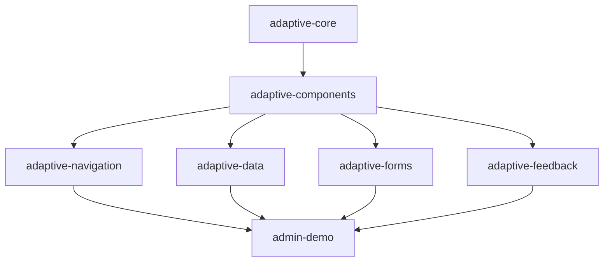

# Plan Mínimo para :adaptive-components

**Fecha:** 2026-05-22

## Objetivo del Módulo

Crear un módulo compartido con componentes visuales atómicos que:
- No introduzcan dependencias cíclicas
- No dependan de navigation, data, forms, feedback, admin-demo
- Sean reutilizables por todos los módulos
- Mantengan Foundation-only (sin Material 3 forzado)
- Usen solo :adaptive-core para dependencias

### Principios de Diseño

1. **Atomicidad**: Componentes de nivel 1 (botones, badges, avatars) no composites
2. **Reutilización**: Un componente por concepto, no variantes de mismo componente
3. **Zero-opinion**: Componentes sin contextos específicos (no "button de tabla", solo button)
4. **Internal helpers**: Helpers visuales internos salvo API pública documentada
5. **Tokens de adaptive-core**: Spacing, radius, widths para layout; NO colores

---

## Dependencias Permitidas

```kotlin
dependencies {
    implementation(project(":adaptive-core"))
    implementation(compose.foundation)
    // NO dependencias de navigation, data, forms, feedback, demo
    // NO icon packs (opcional futuro)
}
```

### Dependencias prohibidas

- :adaptive-navigation
- :adaptive-data
- :adaptive-forms
- :adaptive-feedback
- :admin-demo
- External icon libraries (opcional futuro: :adaptive-icons-*)

---

## Componentes Iniciales Mínimos (PR B2)

### Componentes para PR B2

| Nombre | Signature | Descripción | Uso futuro |
|--------|--|---|---------|
| AdaptiveButton | `@Composable fun AdaptiveButton(text: String, modifier: Modifier, variant: Variant = Primary, onClick: () -> Unit)` | Botón pill con Primary/Secondary/Danger variants, estados hover/pressed/indication | :adaptive-data, :admin-demo, :adaptive-forms |
| AdaptiveIconButton | `@Composable fun AdaptiveIconButton(content: @Composable () -> Unit, onClick: () -> Unit)` | IconButton con shape clip, indication nullable | Opcional PR C |
| AdaptiveBadge | `@Composable fun AdaptiveBadge(text: String, modifier: Modifier, tone: Tone = Neutral)` | Badge con tone mapping (Success/Warning/Danger/Info/Neutral) | :adaptive-data (status), :admin-demo |
| AdaptiveAvatar | `@Composable fun AdaptiveAvatar(name: String, modifier: Modifier, size: Dp = 40.dp, color: Color = Color)` | Avatar con initials de nombre generados | :adaptive-data (avatar columns) |
| AdaptiveCard | `@Composable fun AdaptiveCard(content: @Composable () -> Unit, modifier: Modifier)` | Card base con border, clip, background white | :adaptive-data (cards), :admin-demo |
| AdaptiveSurface | `@Composable fun AdaptiveSurface(content: @Composable () -> Unit, modifier: Modifier = Modifier, color: Color = White)` | Surface opcional con color | :admin-demo, :adaptive-data |

### API Pública (PR B2)

```kotlin
package io.github.adaptivekt.components

public enum class DefaultButtonVariant {
    Primary,
    Secondary,
    Danger,
}

public enum class DemoBadgeTone {
    Neutral,
    Success,
    Warning,
    Danger,
    Info,
}

@Composable
public fun AdaptiveButton(
    text: String,
    modifier: Modifier = Modifier,
    variant: DefaultButtonVariant = DefaultButtonVariant.Primary,
    onClick: () -> Unit,
)

@Composable
public fun AdaptiveIconButton(
    content: @Composable () -> Unit,
    onClick: () -> Unit,
)

@Composable
public fun AdaptiveBadge(
    text: String,
    modifier: Modifier = Modifier,
    tone: DemoBadgeTone = DemoBadgeTone.Neutral,
)

@Composable
public fun AdaptiveAvatar(
    name: String,
    modifier: Modifier = Modifier,
    size: Dp = 40.dp,
    color: Color = Color,
)

@Composable
public fun AdaptiveCard(
    content: @Composable () -> Unit,
    modifier: Modifier = Modifier,
)

@Composable
public fun AdaptiveSurface(
    content: @Composable () -> Unit,
    modifier: Modifier = Modifier,
    color: Color = Color.White,
)
```

### Componentes que NO entran todavía (PR C+)

| Componente | Razón | PR estimado |
|---|---|---|
| AdaptiveTextField | Requiere implementation compleja (focus, caret, validation) | PR C4 |
| AdaptiveSearchField | Variación de TextField | PR C5 |
| AdaptiveDropdownMenu | Requiere popup API compositional | PR C6 |
| AdaptiveMenuItem | Parte de dropdown | PR C6 |
| AdaptiveOverflowMenu | Parte de dropdown/acciones | PR C6 |
| AdaptiveSectionHeader | Simple, puede esperar | PR C2 |
| AdaptiveDivider | Simple, puede esperar | PR C2 |
| AdaptiveStatusBadge | Variante de AdaptiveBadge | PR B3 |
| AdaptiveInfoRow | Row label/value, opcional | PR C7 |
| AdaptiveToggleChip | Chip toggle, opcional | PR C8 |
| AdaptiveKpiCard | Variante de AdaptiveCard | PR B3 |
| AdaptivePanel | Variante de AdaptiveCard | PR B3 |

---

## Componentes con Iconos (futuro PR C)

### Estrategia de iconos

```kotlin
@Composable
public fun AdaptiveButton(
    text: String,
    icon: (@Composable () -> Unit)? = null,  // Futuro
    onClick: () -> Unit,
)
```

### Reglas

- `adaptive-components` NO depende de icon packs
- `admin-demo` puede usar icon pack opcional si compila
- Slot de icono opcional para componentes que lo soporten
- Futuro: `:adaptive-icons-fontawesome`, `:adaptive-icons-lucide` opcionales

---

## Riesgos de Ciclos

### Gráfico de dependencias permitido



### Reglas de ciclos

1. **adaptive-components NO depende** de navigation, data, forms, feedback
2. **Los módulos** pueden depender de :adaptive-components
3. **Los helpers internos** (no públicos) pueden usarse sin exposición
4. **Los tokens** de color deben venir de :adaptive-core (futuro: tokens de color también)

---

## Orden Recomendado de Migración

### PR B1: Stub
- Crear módulo vacío con build.gradle.kts
- Package io.github.adaptivekt.components
- No migrar código todavía
- Build check

### PR B2: Botones y badges
- Agregar AdaptiveButton, AdaptiveIconButton, AdaptiveBadge, AdaptiveAvatar
- Migrar demo usage (si es seguro)
- Build y capturas de:
  - Tablas con acciones
  - Cards KPI
  - Account menu con badge
- Build: `:adaptive-data:build`, `:admin-demo:build`

### PR B3: Cards y surfaces
- Agregar AdaptiveCard, AdaptiveSurface, AdaptiveKpiCard, AdaptivePanel
- Migrar admin-demo cards
- Capturas:
  - Dashboard cards
  - Employees products invoices cards
- Build: `:admin-demo:build`

### PR C1: Avatar y medios
- Mejorar AdaptiveAvatar con color tokens
- Test con employee/product avatars
- Capturas:
  - Employees compact (avatar)
  - Products compact (thumbnail)
- Build: `:admin-demo:build`

### PR C2: Sections y headers
- Agregar AdaptiveSectionTitle, AdaptiveDivider
- Migrar demo sections
- Capturas:
  - Todos los screens con sections
- Build: `:admin-demo:build`

### PR C3: Dropdowns (opcional)
- Agregar AdaptiveDropdownMenu, AdaptiveMenuItem, AdaptiveOverflowMenu
- Migrar account menu
- Capturas:
  - Account menu dropdown
  - Table overflow menus
- Build: `:admin-demo:build`, `:adaptive-data:build`

### PR C4: Textfields
- Agregar AdaptiveTextField, AdaptiveSearchField
- Migrar demo textfields
- Capturas:
  - Settings screen
  - Employee filter
- Build: `:admin-demo:build`, `:adaptive-forms:build`

### PR C5: Chips
- Agregar AdaptiveToggleChip, AdaptiveToggleChip
- Migrar demo chips
- Capturas:
  - Invoice status chips
- Build: `:admin-demo:build`

### PR C6: InfoRow
- Agregar AdaptiveInfoRow (opcional, simple row label/value)
- Migrar demo info rows
- Capturas:
  - Settings info rows

---

## Componentes para NO crear

| Componente | Razón |
|---|----|
| Select, MultiSelect | Requerimientos complejos (búsqueda, validación), futuro PR Select independiente |
| DatePicker, TimePicker | Fuera de alcance de componentes visuales básicos |
| Modal, Dialog | Requiere API compositional avanzado |
| Tooltip | Funcionalidad opcional, puede ser custom por módulo |
| Pagination | Lógica de negocio, no componente visual |
| SortableColumn | Lógica de negocio, no componente visual |

---

## Build Verification

Para cada PR:

```bash
# Build del proyecto
.\gradlew.bat build

# Build de cada módulo dependiente
.\gradlew.bat :adaptive-data:build
.\gradlew.bat :admin-demo:build
.\gradlew.bat :adaptive-forms:build

# Test
.\gradlew.bat test

# Capturas (si aplica)
.\gradlew.bat :admin-demo:captureVisuals
```

---

## Checklist por PR

### PR B2
- [x] build.gradle.kts creado
- [x] Package io.github.adaptivekt.components
- [x] AdaptiveButton implementado
- [x] AdaptiveIconButton implementado
- [x] AdaptiveBadge implementado
- [x] AdaptiveAvatar implementado
- [x] AdaptiveCard implementado
- [x] AdaptiveSurface implementado
- [x] AdaptiveDropdownMenu implementado
- [x] AdaptiveMenuItem implementado
- [x] AdaptiveTextField implementado
- [x] AdaptiveSearchField implementado
- [x] AdaptiveSectionHeader implementado
- [x] AdaptiveDivider implementado
- [x] Build :adaptive-components
- [x] Build general
- [ ] Capturas con botones/badges (fuera de alcance de rescate B1+B2)
- [x] Documentación en ADAPTIVE_COMPONENTS_API.md actualizada

### PR B3
- [x] AdaptiveCard implementado
- [x] AdaptiveSurface implementado
- [ ] AdaptiveKpiCard implementado
- [ ] AdaptivePanel implementado
- [ ] Build todos los módulos
- [ ] Capturas dashboard
- [ ] COMPONENT_CATALOG.md actualizado

---

## Documentación a Actualizar

| Documento | Actualizar |
|---|---|
| COMPONENT_CATALOG.md | Agregar :adaptive-components, documentar nueva API |
| CURRENT_STATE_SUMMARY.md | Referencia a plan de componentes |
| COMPONENTS_ARCHITECTURE.md | Actualizar con implementación real |

---

## Notas

- Este plan mantiene simple la implementación inicial
- Componentes complejos (Select, Modal, Tooltip) fuera de alcance v0.1
- Iconos opcionales, no obligatorios
- Migración gradual por PRs pequeños
- Build verification requerido para cada PR
- Capturas visuales para validar sin regresiones
