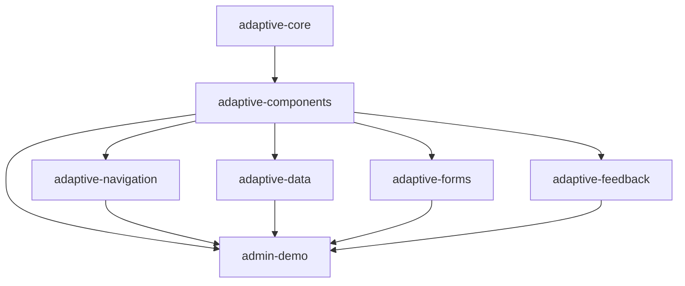

# Arquitectura de adaptive-components

## Módulo propuesto: :adaptive-components

- Depende de: `:adaptive-core`
- NO debe depender de: navigation, data, forms, feedback, admin-demo

### Contenido mínimo propuesto
- AdaptiveButton
- AdaptiveIconButton
- AdaptiveBadge
- AdaptiveAvatar
- AdaptiveDropdownMenu
- AdaptiveMenuItem
- AdaptiveCard
- AdaptiveSurface
- AdaptiveTextField
- AdaptiveSearchField
- AdaptiveSectionHeader
- AdaptiveDivider

### Módulos consumidores
- adaptive-navigation
- adaptive-data
- adaptive-forms
- adaptive-feedback
- admin-demo

### Diagrama de dependencias permitidas

- adaptive-components NO debe depender de ningún consumidor.
- No debe haber ciclos.
- Los helpers visuales deben ser internal salvo API pública documentada.
- Los tokens de color/spacing/radius deben venir de adaptive-core.
